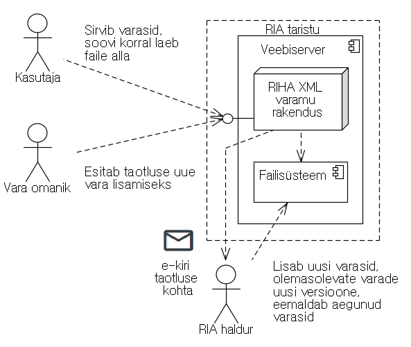

# RIHA varamu

[RIHA varamu](https://varamu.riha.ee) on veebirakendus, mille kaudu tehakse avalikult kättesaadavaks asutustevahelises dokumendivahetuses kasutatavad varad (metaandmete andmekirjeldused). Ajutiselt (kuni klassifikaatorite mooduli valmimiseni) ka osad klassifikaatorid.

## Varamust lähemalt

- RIHA varamu ülesandeks on kontrollida ja avaldada dokumendiliigi ning metaandmete andmekirjeldusi, mida edastatakse [asutustevahelise dokumendivahetuslahenduse (DVK/DHX)](https://www.ria.ee/ee/dokumendivahetus-dhx.html) kaudu.
- Kui andmekirjeldus on koostatud ja kooskõlastatud [vastavalt nõuetele](https://mkm.ee/sites/default/files/juhis_dokumendiliigi_xml_andmekirjelduse_koostamiseks.pdf), siis lähtutakse sellest seda liiki dokumentide koostamisel mistahes vormingus.
- Asutuse loodud dokumendi elementide koosseis lähtub vastava dokumendiliigi andmekirjeldusest, kui see on RIHAs registreeritud. Sellist liiki dokumendi ja selle veebivormide koostamisel võetakse aluseks andmekirjeldus.
- Dokumendi metaandmed peavad olema kooskõlas RIHAs registreeritud dokumendihalduse metaandmeloendi ja dokumendiliigi andmekirjeldusega.
- Otseste avalike teenuste osutamiseks vajaliku teabe kindlaksmääramist, jagamist ja vahetamist koordineeriv asutus on [Majandus- ja Kommunikatsiooniministeerium](https://www.mkm.ee/et/tegevused-eesmargid/infouhiskond/dokumendihaldusest-infohalduseni) ning RIHA varamu tegutseb [teenuste korraldamise ja teabehalduse alustel](https://www.riigiteataja.ee/akt/131052017007?leiaKehtiv).

## Kasutuslood

Kasutaja (varadega tutvuja, nende kasutaja) saab:

- sirvida varasid
- alla laadida varade faile.

Vara omanik saab:

- esitada taotluse uue vara lisamiseks.

RIA haldur saab:

- lisada uue vara või täiendada olemasolevat

## Arhitektuur



## Vajalikud tehnoloogiad

- PHP (Töötab versioonil 7.1.6) - vajalik ainult uuendamiseks lokaalses masinas
- Python 3.x.x ja mikroveebiraamistik Bottle - vajalik ainult API käitamiseks (hetkel ei ole kasutusel)
- rakendus kasutab tehnoloogiaid: Bootstrap 4, Chart.js, jQuery, Datatables.

## Paigaldamine

* Tõsta veebiserveri DocumentRoot kausta kaust `htdocs` **sisu** nii, et selle sisu oleks kättesaadav veebiserveri juurkataloogist.
* Kontrolli, kas:
  * põhikaust töötab, st https://varamu.riha.ee avaneb varamu leht tabeliga, kus erinevad varad ridadena
  * 404 vealeht on korrektne, st https://varamu.riha.ee/404 avaneb kena "Lehekülge ei leitud" teade
* Vajadusel restardi Apache
* Valmis!

## Vara kirjeldamine

Vara kirjeldatakse vara kasutas `resource.json` failina järgmiselt:

```
[
    {
    "name": "Õigusakt",
    "version": "1",
    "start_date": "10.02.2010",
    "end_date": "",
    "description": "Skeemid XML struktuuriga õigusaktide koostamiseks ja avaldamiseks Riigi Teatajas.",
    "type": "Dokumendiliigi XML andmekirjeldus",
    "owner": "Justiitsministeerium",
    "status": "Registreeritud"
  }
]
```

- vara ametlik nimetus
- versiooni tähis
- kehtivuse alguskuupäev
- kehtivuse lõpukuupäev
- vara kirjeldus
- vara liik (võib olla mitu tk kasutades Array tüüpi elementi)
  - dokumendiliigi XML andmekirjeldus
  - standardsed metaandmed
  - andmevahetuse konteiner
  - klassifikaator
- haldaja (asutus, kes vastutab vara arendamise ja RIHAs kirjeldamise eest)
- staatus
  - registreeritud
  - lõpetatud
  - (tulevikus võib kasutusele võtta ka muid staatusi)

## Uue vara lisamine

Loo kausta `htdocs/resources` uus kaust, mille nimi on `Vara_nimi`. Vaata, et kaustanimes kõik tühikud oleks asendatud alamkriipsuga `_` ja ei kasutataks täpitähti. Lähtu inimsõbraliku/semantilise URLi põhimõtetest.

Kausta sisu struktuur jaguneb kaheks sõltuvalt, kas varal on mitu  versiooni või mitte. Versiooni kaustu tuleks tähistada eesliitega `v`, millele järgneb versiooni tähis (soovitavalt täisarvud või punktiga eristatud numbrid).

Kui kaustal on ainult üks versioon:
```
* resources
    * Oigusakt
        * fail.xml
        * fail2.xsd
        * fail3.pdf
        * resource.json
```

Kui kaustal on näiteks kaks versiooni:
```
* resources
    * Oigusakt
        * v1.0
            * fail.xml
            * fail2.xsd
            * fail3.pdf
            * resource.json
        * v2.1
            * fail.xml
            * fail2.xsd
            * fail3.pdf
            * resource.json
```
Lisa nende skeemide järgi vajalikud failid uue vara kausta. Küsimuste korral tasub vaadata juba olemas olevate varade kaustu.

Ka failide puhul on tähtis, et tühikuid ja täpitähti ei oleks ning lähtuda inimsõbraliku/semantilise URLi põhimõtetest.

**TÄHTIS:** Pärast failide lisamist mine oma lokaalse arvutiga lehele `[varamu veebiaadress lokaalses veebserveris]/updateResources/`, millega uuendatakse rakenduse poolt kasutatavat `htdocs/resources/resources.json` faili. Veendu, et rakendus lõpetas töö edukalt ja faili uuendati.

**TÄHTIS:** Kui tegid muudatusi vana RIHA poolt avaldatud failide nimedes/kaustades, siis tuleb paigaldusel uuendada ka [F5 seadistus](redirect.txt).

Uuenda lähtekoodi Githubis ning pärast master harusse commit-i avaldatakse muudatused järgmisel päeval RIHA varamu ametlikul lehel https://varamu.riha.ee

## REST API paigaldamine

**Hetkel pole see funktsionaalsus kasutusel!**

RIHA varamu rakendab kasutusloos "uue vara taotluse esitamine" mikroteenust taotluse salvestamiseks. Mikroteenuse paigaldamiseks on kõige otstarbekam rakendada Pythoni paketihaldurit pip. Debian/Ubuntu operatsioonisüsteemil tuleb pip installeerimiseks käivitada:
```
sudo apt-get install python-pip
```
Paketihalduriga installeerime mikroveebiraamistiku Bottle:
```
pip install bottle
```
Mikroteenuse skript asub `saveResource` kaustas. Seal paiknev fail `service.py` tuleb asetada failisüsteemis kausta, kuhu on skripti vahendusel võimalik faile maha salvestada. Fail `add.html` tuleb paigutada DocumentRoot kausta.

Skriptis tuleb vajadusel konfigureerida mikroteenust käitava masina host IP-d ja porti:
```
app.run(host='varamu.riha.ee', port=443)
```
Skripti käivitatakse käsuga:
```
python3 service.py
```

## Autorid

* **Janar Peterson** - RIA praktikant
* **Raimond Roosalu** - RIA praktikant
* **Taavi Meinberg** - RIA praktikant
* **Hannes Kiivet** - RIHA valdkonnajuht
